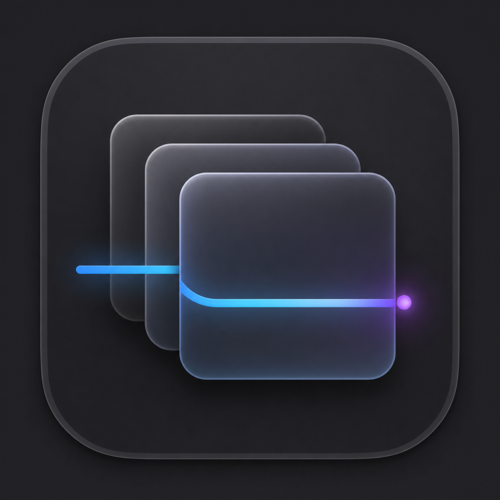

# TrackPadFlow
<p align="center">
  
</p>

<h1 align="center">TrackpadFlow</h1>

<p align="center">
  用 Command + 双指手势管理 macOS 窗口与工作场景。<br>
  A lightweight, native trackpad workflow utility for macOS.
</p>

<p align="center">
  
  
  
</p>

TrackpadFlow 是一个原生 macOS 菜单栏应用。它用明确的 `Command` 修饰键接管双指滚动，将窗口最小化、恢复和工作场景保存变成连续、低干扰的手势。

项目使用 SwiftUI、AppKit、Core Graphics 与 macOS Accessibility API 构建，无第三方运行时依赖，不上传窗口、点击或使用数据。

> 当前版本：`0.1.0`（早期公开测试）。建议先阅读[权限说明](docs/PERMISSIONS.md)和[已知边界](#已知边界)。

## 功能

| 操作 | 结果 |
| --- | --- |
| `Command` + 双指右滑 | 最小化当前窗口并压入恢复栈 |
| `Command` + 双指左滑 | 恢复栈顶窗口 |
| `Command` + 双指下滑 | 保存当前可见工作场景 |
| `Command` + 双指上滑 | 恢复已保存的工作场景 |
| 起点双击 → 滚动 → 终点双击 | 使用 Shift-click 扩展文本选区 |
| 鼠标左键点击 | 可选的轻量点击波纹反馈 |

另外支持：

- 调整横向手势触发步长；
- 反转左右手势方向；
- Finder 与起点附近连续双击保护；
- 菜单栏常驻，不占用 Dock；
- 尊重“减少动态效果”和低电量模式；
- 场景恢复只处理实际可见窗口，减少闪烁和焦点争抢。

## 系统要求

- macOS 14 Sonoma 或更高版本；
- 带触控板的 Mac，或能够产生连续滚动事件的兼容输入设备；
- 从源码构建需要 Swift 6 / Xcode 16 或更高版本。

构建产物默认为当前 Mac 架构。正式 Release 是否提供 Apple Silicon、Intel 或 Universal Binary，以对应版本的发布说明为准。

## 安装

### 从 GitHub Release 安装

发布二进制后，可在仓库的 [Releases](../../releases) 页面下载压缩包：

1. 解压 `TrackpadFlow.app`；
2. 将它移动到 `/Applications`；
3. 启动 TrackpadFlow，并点击菜单栏图标；
4. 按照面板的一键入口授予所需权限。

请先移动到 `/Applications` 再授权。移动或替换不同签名的 App 后，macOS 可能要求重新确认辅助功能权限。

### 从源码构建

克隆仓库并进入项目目录，然后运行：

```bash
./Scripts/build_app.sh
./Scripts/install_local.sh
```

也可以只构建并运行开发副本：

```bash
./Scripts/run_app.sh
```

SwiftPM 缓存默认放在 macOS 用户缓存目录，不写入仓库。需要指定缓存根目录时：

```bash
TRACKPADFLOW_ENV_ROOT=/path/to/cache ./Scripts/build_app.sh
```

## 权限

TrackpadFlow 需要以下 macOS 权限：

1. **辅助功能**：最小化、恢复、聚焦和排列窗口；
2. **输入监控**：创建可拦截的 Event Tap，让 `Command` 手势不会同时触发前台 App 的滚动逻辑。

未授权时，面板会显示“一键申请并打开系统设置”。该按钮会发出系统请求并打开正确页面；受 macOS TCC 安全机制限制，最终开关必须由用户亲自确认，应用无法静默授权自己。

详细流程与故障排查见 [docs/PERMISSIONS.md](docs/PERMISSIONS.md)。

## 使用方式

1. 从菜单栏打开 TrackpadFlow；
2. 完成权限配置；
3. 按住 `Command`，再执行双指手势；
4. 在面板中调节“触发步长”，找到适合自己触控板的距离。

右滑最小化使用 LIFO 栈：依次收起 A、B、C 后，连续左滑会按 C、B、A 的顺序恢复。场景快照与恢复是一次性命令，触发后无需继续按住 `Command` 等待窗口处理完成。

## 隐私

- 不连接网络；
- 不包含分析、遥测、广告或账号系统；
- 不录制屏幕，不读取窗口像素；
- 不保存点击位置或窗口标题历史；
- 设置仅保存在本机 `UserDefaults`；
- Accessibility 与 Event Tap 数据只在内存中用于执行用户主动触发的操作。

完整说明见 [docs/PRIVACY.md](docs/PRIVACY.md)。

## 已知边界

- macOS 公共事件 API 不保证能准确区分“来自两根手指”的所有滚动设备，`Command` 是本项目的明确手势边界；
- 一些应用对 Accessibility 窗口属性支持不完整，场景恢复可能跳过无法识别的窗口；
- 本地 ad-hoc 签名每次构建都会改变代码身份，可能需要重新授权。公开 Release 应使用稳定 Developer ID 签名并完成 notarization；
- 双击端点框选依赖目标应用对 Shift-click 与可访问文本位置的支持。

## 项目结构

```text
Sources/TrackpadFlow/     SwiftUI / AppKit 源码
Resources/                Info.plist、应用图标和 Logo
Scripts/                  构建、安装、验证和发布打包脚本
docs/                     架构、权限、隐私、开发与发布文档
.github/                  CI、Issue 表单和 PR 模板
```

架构说明见 [docs/ARCHITECTURE.md](docs/ARCHITECTURE.md)，开发约定见 [docs/DEVELOPMENT.md](docs/DEVELOPMENT.md)。历史实现与排障经验保存在 [docs/DEVELOPMENT_NOTES.md](docs/DEVELOPMENT_NOTES.md)。

## 验证

```bash
./Scripts/verify.sh
```

验证脚本会解析 Swift Package、执行 Release 构建、生成 `.app`、检查 `Info.plist` 并验证代码签名。GitHub Actions 对 push 和 pull request 执行同一套检查。

## 贡献

欢迎提交 Bug、兼容性报告和小而清晰的改进。开始前请阅读 [CONTRIBUTING.md](CONTRIBUTING.md) 与 [CODE_OF_CONDUCT.md](CODE_OF_CONDUCT.md)。安全问题请按照 [SECURITY.md](SECURITY.md) 私下报告。

## 许可证

TrackpadFlow 使用 [MIT License](LICENSE)。
